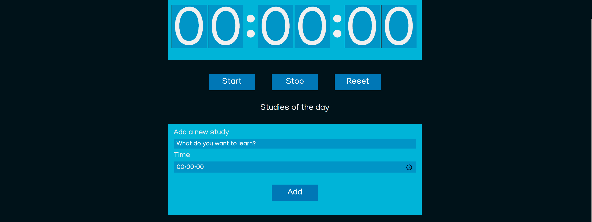

# Alura Course React: writing with Typescript 

<h1 align="center"> </h1>

**About this Project:**

This site allows you to add tasks and run them on the timer, after finishing they are marked as complete automatically.

To perform these activities, React and TypeScript were used. The componetization was done to separate the components and later be able to reuse them, through the “function components”. The communication between them was done through "Props" and the recognition of the component's internal state with "State".

To style the page, Sass was used to facilitate construction and CSS modules to avoid overlaps.

**Technologies**

- React
- TypeScript
- CSS(Sass)

**Course Link:**

https://cursos.alura.com.br/course/react-modernizando-escrever-typescript